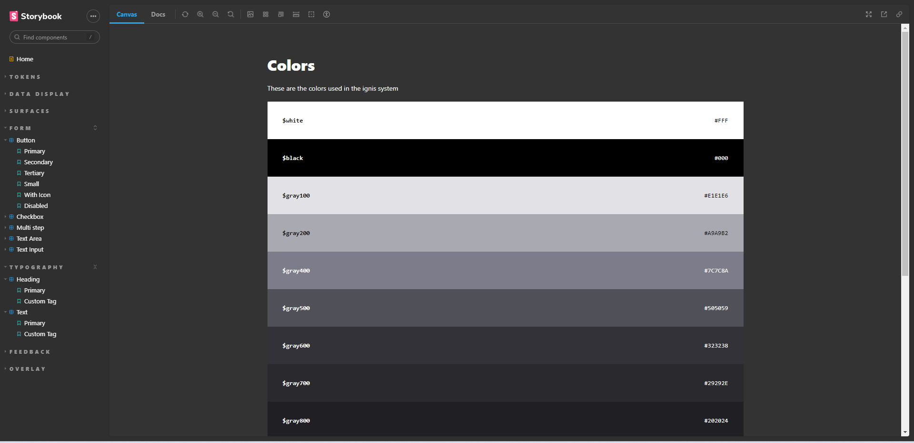

# Ignis Design System- Making Better Products, Faster

<p align="center">

</p>
<br><br>

<p align="center">
  <a href="#-about-the-project">About the project</a> •
  <a href="#-technologies">Technologies</a> •
  <a href="#-getting-started">Getting started</a> •
  <a href="#-license">License</a>
</p>

<p align="center">
  
</p>

## 👩‍💻 About the project

Ignis is an open source system that gives designers and programmers the framework they need to start, evolve and unify their applications.

Developed with Storybook and turboRepo, aiming for system and build optimization !

The packages for the design system are published in [NPM](https://www.npmjs.com/package/@ignis-design-system/react), available for installation with the following command:

```sh
npm i @ignis-design-system/tokens     # npm
npm i @ignis-design-system/react       # npm
```

Project built during [Rocketseat](https://rocketseat.com.br/) ReactJS course, where I was able to deepen my knowledge of this front-end library

[click here, see closer](https://leandrorodrigues00.github.io/ignis-design-system/?path=/story/home--page) 😉

## 🚀 Technologies

- [ReactJs](https://reactjs.org/)
- [Stitches](https://stitches.dev/)
- [TurboRepo](https://turbo.build/)
- [Storybook](https://storybook.js.org/)
- [Radix Ui](https://www.radix-ui.com/)

## 💻 Getting started

### Requirements

- [Node.js](https://nodejs.org/en/)
- [Yarn](https://classic.yarnpkg.com/) or [NPM](https://www.npmjs.com/) _(examples are with yarn)_

**Clone the project and access the folder**

```bash
$ git clone https://github.com/leandrorodrigues00/ignis-design-system && cd ignis-design-system

```

**Follow the steps below**

```bash
# Install the dependencies
$ yarn

# Make a copy of '.env.example' to '.env'
# and set with YOUR environment variables.
$ cp .env.example .env

# Start the app
$ yarn dev
```

## 📝 License

This project is licensed under the MIT License - see the [LICENSE](LICENSE) file for details.

---

<p align="center">
  Made with 💜&nbsp; by  Leandro Rodrigues
</p>
